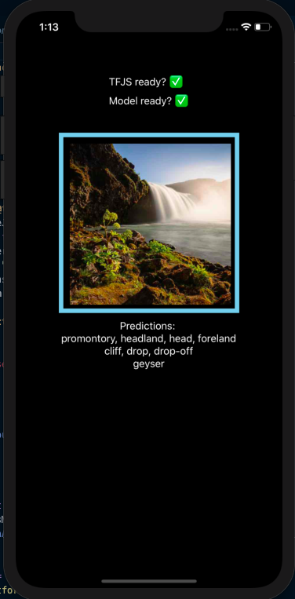

# React Native Image Classifier App
A React Native app which uses Tensorflow.js and Mobilenet to classify images.

## Screenshot

## To Run
- Clone into repo
- Run `yarn`
- Run `yarn ios` or `yarn android`